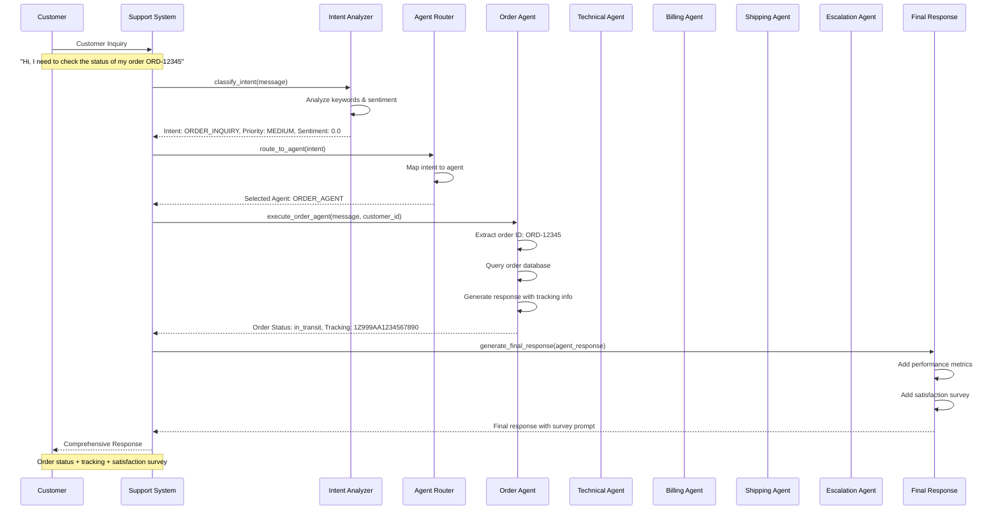
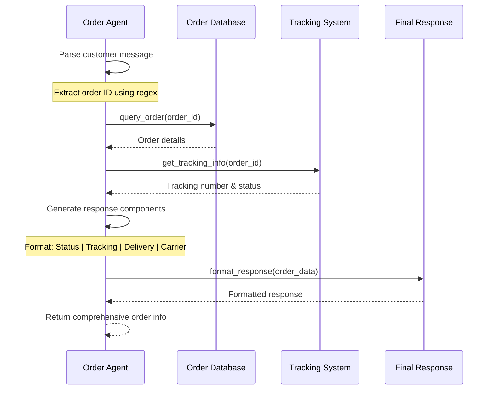
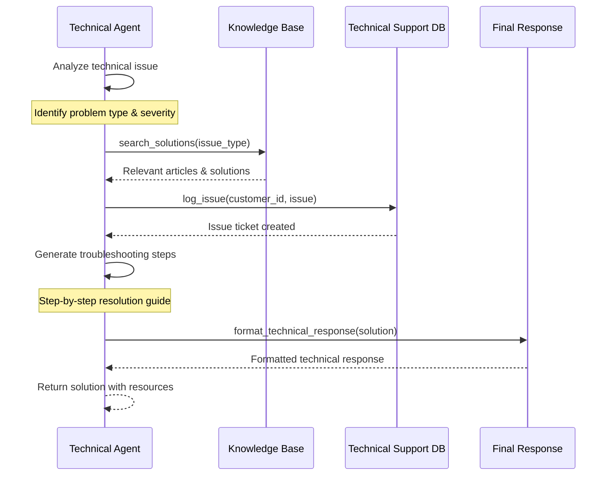
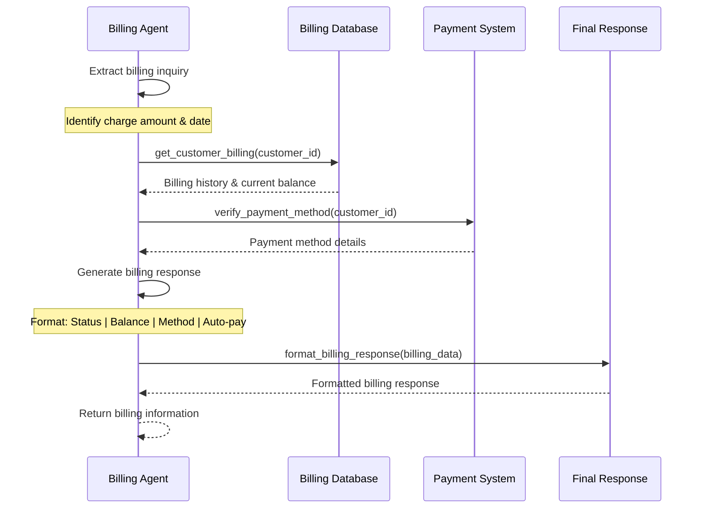
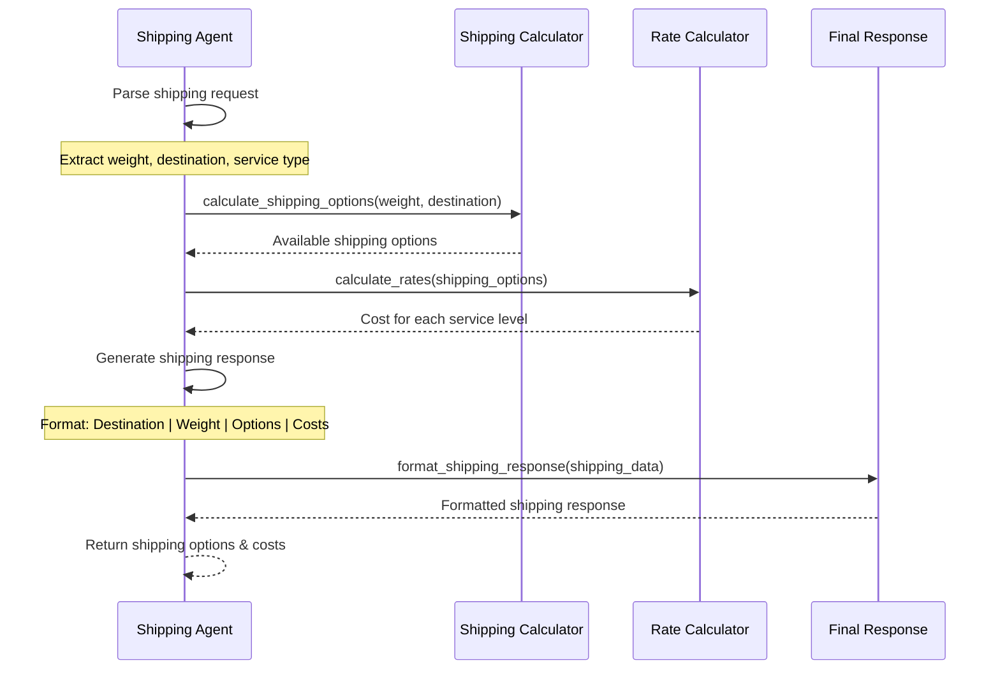
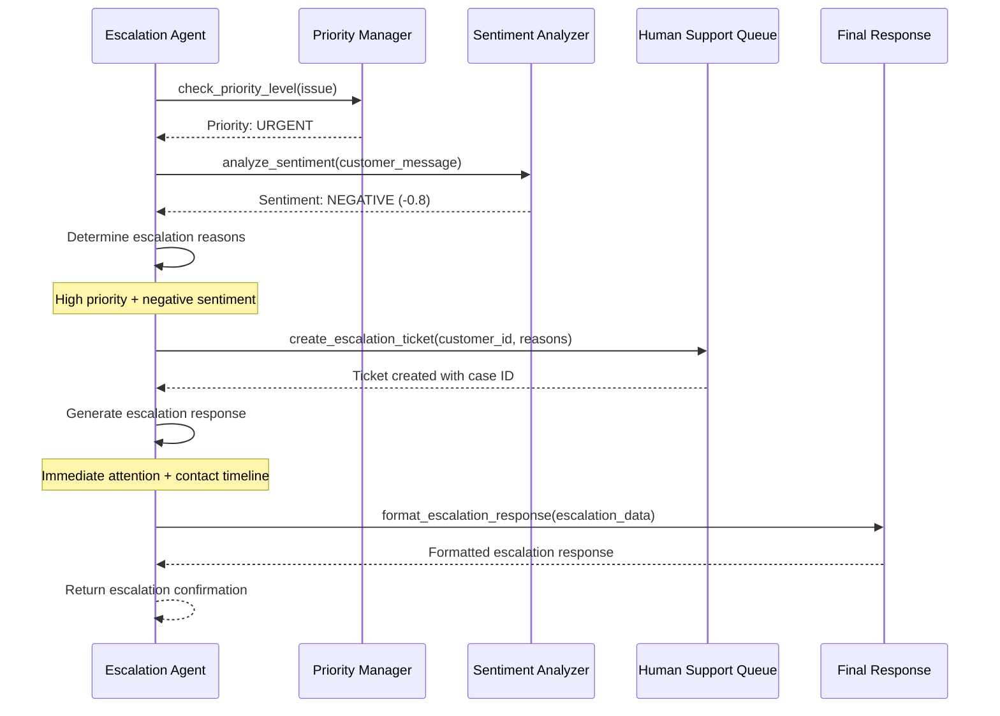
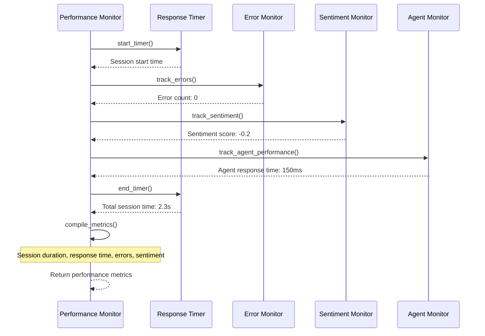
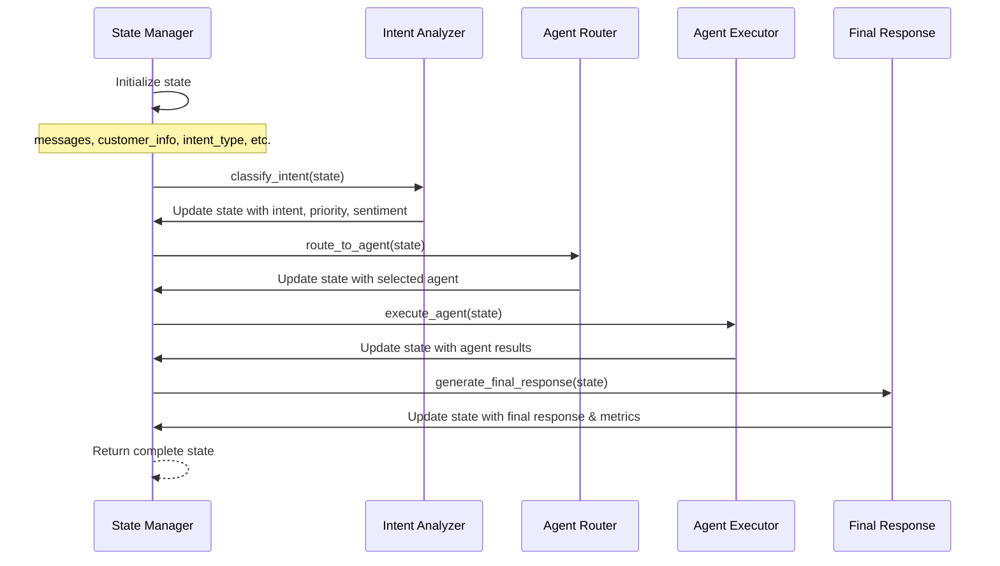
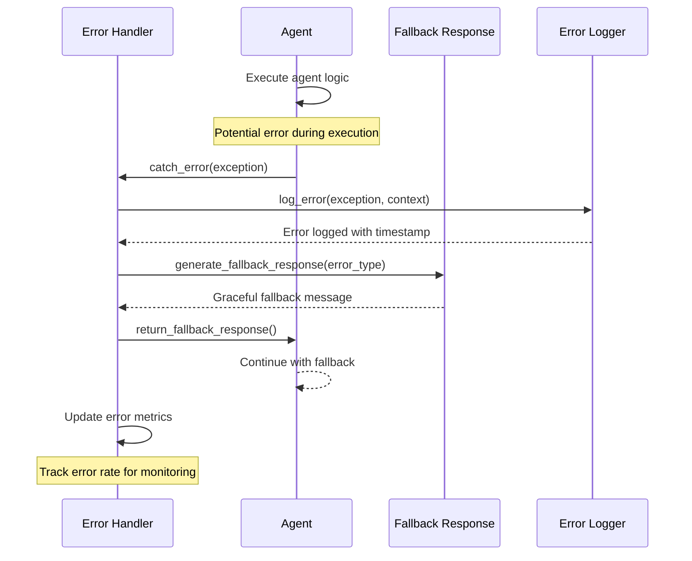
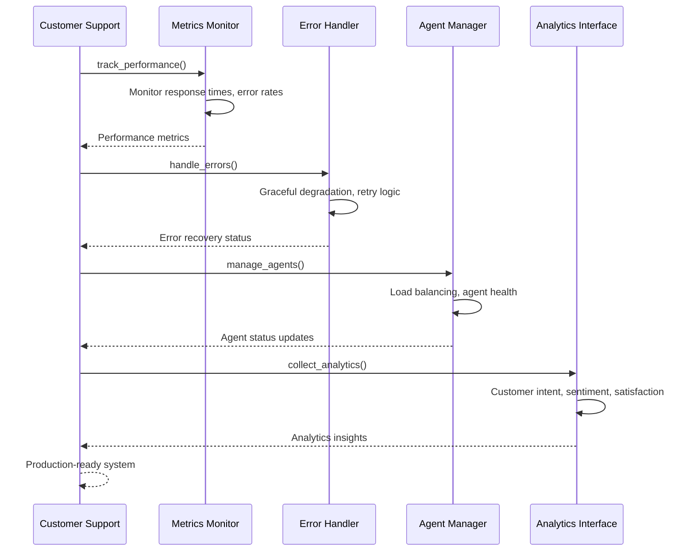

# Customer Support Agentic Flow - Sequence Diagrams

## 🚀 Overview: Real-world Customer Support System

This document provides detailed sequence diagrams for the customer support agentic flow, showing how multiple specialized agents work together to handle customer inquiries.

## 📋 System Architecture

```
┌─────────────────────────────────────────────────────────────────┐
│                    Customer Support AI System                  │
│                    Production-Ready Architecture               │
└─────────────────────────────────────────────────────────────────┘

Customer Inquiry
    ↓
┌─────────────────┐
│ Intent Analysis │ ← Classifies customer needs and priority
└─────────┬───────┘
          │
          ▼
┌─────────────────┐
│ Agent Routing   │ ← Routes to specialized agent
└─────────┬───────┘
          │
    ┌─────┴─────┐
    ▼           ▼
┌─────────┐ ┌─────────┐
│Order    │ │Technical│ ← Specialized agents
│Agent    │ │Agent    │   working in parallel
└────┬────┘ └────┬────┘
     │           │
     ▼           ▼
┌─────────┐ ┌─────────┐
│Billing  │ │Shipping │ ← More specialized agents
│Agent    │ │Agent    │
└────┬────┘ └────┬────┘
     │           │
     └─────┬─────┘
           ▼
    ┌─────────────┐
    │ Escalation  │ ← Human intervention when needed
    │   Agent     │
    └─────┬───────┘
          │
          ▼
    ┌─────────────┐
    │ Final       │ ← Comprehensive response
    │ Response    │   with follow-up actions
    └─────────────┘
```

## 🔄 Sequence Diagram: Complete Customer Support Flow



## 📦 Sequence Diagram: Order Agent Flow



## 🔧 Sequence Diagram: Technical Support Flow



## 💰 Sequence Diagram: Billing Agent Flow



## 🚚 Sequence Diagram: Shipping Agent Flow



## 🚨 Sequence Diagram: Escalation Agent Flow



## 🔄 Code Sequence: Complete Workflow Implementation

```python
# Customer Support System Workflow
class CustomerSupportSystem:
    def process_customer_inquiry(self, message: str, customer_id: str):
        """
        Complete workflow sequence:
        1. Intent Classification
        2. Agent Routing  
        3. Agent Execution
        4. Response Generation
        5. Performance Metrics
        """
        
        # Step 1: Intent Classification
        intent, priority, sentiment = self.classify_intent(message)
        
        # Step 2: Agent Routing
        agent = self.route_to_agent(intent)
        
        # Step 3: Agent Execution
        if agent == AgentType.ORDER_AGENT:
            agent_response = self.execute_order_agent(message, customer_id)
        elif agent == AgentType.TECHNICAL_AGENT:
            agent_response = self.execute_technical_agent(message)
        elif agent == AgentType.BILLING_AGENT:
            agent_response = self.execute_billing_agent(customer_id)
        elif agent == AgentType.SHIPPING_AGENT:
            agent_response = self.execute_shipping_agent(message)
        elif agent == AgentType.ESCALATION_AGENT:
            agent_response = self.execute_escalation_agent(priority, sentiment)
        
        # Step 4: Final Response Generation
        final_response = self.generate_final_response(agent_response)
        
        # Step 5: Return Results
        return {
            "intent": intent.value,
            "priority": priority.value,
            "agent": agent.value,
            "sentiment": sentiment,
            "final_response": final_response,
            "performance_metrics": self.performance_metrics
        }
```

## 📊 Performance Metrics Sequence



## 🔄 State Management Sequence



## 🎯 Error Handling Sequence



## 📈 Real-world Example Scenarios

### **Scenario 1: Order Tracking**
```
Customer: "Hi, I need to check the status of my order ORD-12345"

Sequence:
1. Intent Classification → ORDER_INQUIRY
2. Agent Routing → ORDER_AGENT  
3. Order Agent → Extract ORD-12345, query database
4. Response → "Order Status: in_transit | Tracking: 1Z999AA1234567890"
5. Final Response → Add satisfaction survey
```

### **Scenario 2: Technical Support**
```
Customer: "My wireless headphones are not connecting to my phone"

Sequence:
1. Intent Classification → TECHNICAL_SUPPORT
2. Agent Routing → TECHNICAL_AGENT
3. Technical Agent → Analyze issue, search knowledge base
4. Response → "Issue Type: product_setup | Solution: Restart device..."
5. Final Response → Add troubleshooting resources
```

### **Scenario 3: Billing Question**
```
Customer: "I noticed a charge on my account for $89.99"

Sequence:
1. Intent Classification → BILLING_ISSUE
2. Agent Routing → BILLING_AGENT
3. Billing Agent → Query billing database
4. Response → "Payment Status: current | Balance: $0.00"
5. Final Response → Add payment method info
```

### **Scenario 4: Shipping Inquiry**
```
Customer: "I want to ship a 3kg package to Los Angeles"

Sequence:
1. Intent Classification → SHIPPING_TRACKING
2. Agent Routing → SHIPPING_AGENT
3. Shipping Agent → Calculate shipping options
4. Response → "Standard: $12.99 | Express: $24.99 | Overnight: $39.99"
5. Final Response → Add delivery timeframes
```

### **Scenario 5: Complaint Escalation**
```
Customer: "I'm extremely unhappy with your service!"

Sequence:
1. Intent Classification → COMPLAINT
2. Agent Routing → ESCALATION_AGENT
3. Escalation Agent → Analyze priority & sentiment
4. Response → "🚨 This requires immediate attention..."
5. Final Response → Create escalation ticket
```

## 🏭 Production Features Sequence



## 🎉 Key Benefits of This Architecture

✅ **Scalable**: Multiple specialized agents working in parallel  
✅ **Reliable**: Comprehensive error handling and fallback mechanisms  
✅ **Intelligent**: Dynamic routing based on intent and sentiment  
✅ **Monitorable**: Real-time performance tracking and analytics  
✅ **Maintainable**: Clean separation of concerns and modular design  
✅ **Production-Ready**: Enterprise-grade customer support system  

This sequence diagram approach demonstrates how to build a **real-world, production-ready customer support system** using LangChain and LangGraph concepts! 🚀 